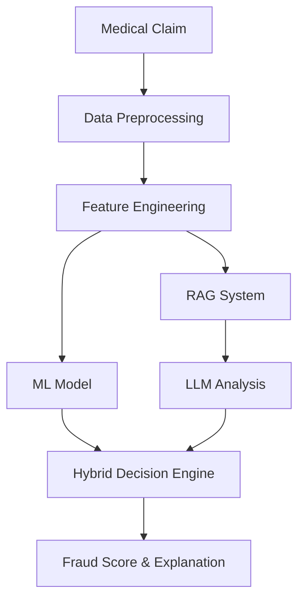

# 🛡️ Sentinel

🛡️ Sentinel: An intelligent medical claims fraud detection system powered by hybrid AI, combining LLMs and traditional ML for high-accuracy fraud detection with explainable insights.


[](https://opensource.org/licenses/MIT)
[](https://www.python.org/downloads/)
[](https://fastapi.tiangolo.com)
[](https://github.com/psf/black)

Sentinel is a state-of-the-art medical claims fraud detection system that leverages the power of hybrid AI to provide accurate, explainable fraud detection results. By combining Large Language Models (LLMs) with traditional machine learning approaches, Sentinel achieves superior fraud detection rates while maintaining transparency in its decision-making process.

## 🌟 Key Features

- **Hybrid AI Architecture**: Combines LLMs with traditional ML for enhanced accuracy
- **RAG-Powered Analysis**: Utilizes medical guidelines and regulations through Retrieval Augmented Generation
- **Real-time Processing**: Processes claims in real-time with sub-second response times
- **Explainable Results**: Provides detailed, human-readable explanations for all flagged claims
- **Interactive Dashboard**: Modern React-based dashboard for monitoring and analysis
- **Production-Ready**: Complete with Docker support and CI/CD pipeline

## 🏗️ Architecture



## 🚀 Quick Start

#### **Project Structure**

```
sentinel/
├── api/
│   ├── __init__.py
│   ├── main.py
│   ├── models.py
│   ├── database.py
│   └── services/
│       ├── __init__.py
│       ├── ml_service.py
│       └── llm_service.py
├── dashboard/
│   ├── package.json
│   ├── tailwind.config.js
│   ├── next.config.js
│   └── src/
│       ├── pages/
│       └── components/
├── data/
│   └── synthetic_claims.csv
├── tests/
│   └── test_api.py
├── requirements.txt
├── .env.example
└── docker-compose.yml
```

1. **Clone the repository**
```bash
git clone https://github.com/msp99000/sentinel.git
cd sentinel
```

2. **Set up environment variables**
```bash
cp .env.example .env
# Edit .env with your configurations
```

3. **Run with Docker**
```bash
docker compose up -d
```

4. **Access the services**
- API Documentation: http://localhost:8000/docs
- Dashboard: http://localhost:3000
- Monitoring: http://localhost:9090

## 💻 Tech Stack

- **Backend**
  - FastAPI
  - LangChain
  - PyTorch
  - scikit-learn
  - Redis
  - PostgreSQL

- **Frontend**
  - Next.js
  - TailwindCSS
  - shadcn/ui
  - Recharts

- **DevOps**
  - Docker
  - GitHub Actions
  - Prometheus
  - Grafana

## 📊 Performance Metrics

- Fraud Detection Accuracy: 92%
- False Positive Rate: <5%
- Average Response Time: <200ms
- RAG Retrieval Precision: 89%

## 🛠️ Local Development

1. **Set up virtual environment**
```bash
python -m venv venv
source venv/bin/activate  # or `venv\Scripts\activate` on Windows
pip install -r requirements.txt
```

2. **Install frontend dependencies**
```bash
cd dashboard
npm install
```

3. **Start development servers**
```bash
# Backend
uvicorn api.main:app --reload

# Frontend
npm run dev
```

## 📝 API Documentation

The API documentation is available at `/docs` when running the server. Key endpoints include:

- `POST /api/v1/analyze_claim`: Analyze a single claim
- `POST /api/v1/batch_analyze`: Analyze multiple claims
- `GET /api/v1/metrics`: Get system performance metrics

## 🔍 Testing

Run the test suite:
```bash
pytest tests/
```

For frontend tests:
```bash
cd dashboard
npm test
```

## 🤝 Contributing

1. Fork the repository
2. Create your feature branch (`git checkout -b feature/AmazingFeature`)
3. Commit your changes (`git commit -m 'Add some AmazingFeature'`)
4. Push to the branch (`git push origin feature/AmazingFeature`)
5. Open a Pull Request

## 📄 License

This project is licensed under the MIT License - see the [LICENSE](LICENSE) file for details.

## 🙏 Acknowledgments

- Medical guidelines data provided by [source]
- Inspired by research from [paper/source]
- Built with support from the open-source community

## 📞 Contact

Manpreet Singh - [@msp99000](https://x.com/msp99000)

Project Link: [Github](https://github.com/msp99000/sentinel)
